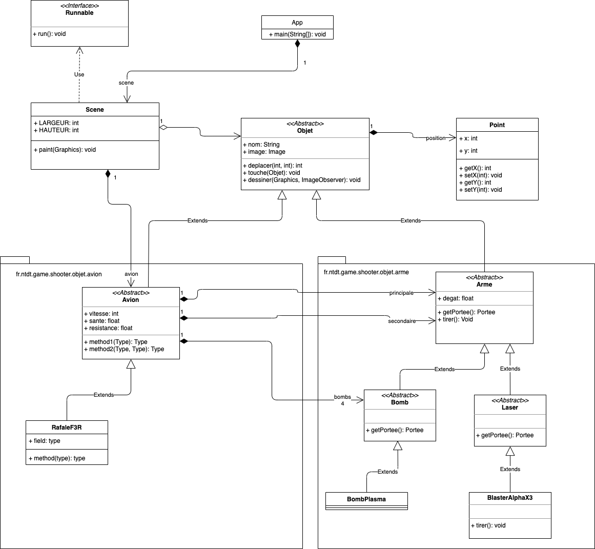

# Un **Shoot'em Up** en Java

Ce projet sert comme base pour la formation sur le langage Java. Les élèves vont réaliser le jeu au fure et à mesure sous forme de de plusieurs travaux pratiques (TP).


## Présentations


## Principes de gestion des versions du jeu

La branche principale `master` représente la dernière version du jeu compilable et exécutable. Les versions finales seront prélevées à partir de cette branche sous forme de `tags versionnés` en utilisant le système de versioning `x.y.z`.

Les TP seront tirés à partir de la branche `develop` qui est elle-même issue de la branche `master`. Une fois qu'une fonctionnalité est implémentée (par le formateur), elle sera mergée dans cette branche pour être partagée avec tous les participants.

A la fin du TP, une `release` du jeu sera créée sous forme d'une branche nommée `release/x.y.z` à partir de la branche `develop`. Une fois que cette release a été testé et qu'il n'y aucun bug détecté, elle est sera mergée sur la branche `master`.

## Démarrage rapide

### 1. Récupérer les sources du projet depuis Github

```
git clone https://github.com/nntran/java-shooter-game
```
    
### 2. Compiler le projet

Utilise le script `build.sh` (pour Linux) ou `build.bat` (pour Windows) pour compiler les fichiers Java.

Il faudra penser à enrichir ce script pour ajouter les nouvelles classes Java que vous allez mettre en oeuvre.

Ouvrez un terminal et positionnez-vous dans le dossier du projet et lancez la commande ci-dessous:

**Sous Linux**

```sh
./build.sh
```

ou

```sh
sh build.sh
```

**Sous Windows**

```sh
./build.bat
```

### 3. Lancer le jeu

Pour lancer l'application, il faut utiliser le script `start.sh` (pour Linux) ou `start.bat` (pour Windows) fourni. 

**Sous Linux**

```sh
./start.sh
```

ou

```sh
sh start.sh
```

**Sous Windows**

```sh
./start.bat
```

## Travaux pratiques

Pour chaque TP, vous devez créer une branche nommée `<votre prenom>/tpx` à partir de la branche `develop`.

### Comment ça marche ?

1. Positionnez-vous dans le dossier de formation, puis commencez par récupérer le projet :

```
git clone https://github.com/nntran/java-shooter-game
```

2. Basculez sur la branche `develop` puis créez la branche `<votre prenom>/tpx` en indiquant votre prénom et le numéro du TP:

```
git checkout formation
git branch <votre prenom>/tpx
```

### Comment récupérer les sources d'un de vos TPs ?

```
git checkout <votre prenom>/tpx
```


### TP #1


### TP #2

### TP #3

Dans ce TP, vous allez concevoir des `avions` et des `armes` du jeu. Vous allez apprendre à :

* Concevoir des classes (Avion, Arme, ...)
* Faire de l'héritage
* Implémenter des classes et des méthodes abstraites (`abstract`)
* Surcharger des méthodes de la **super classe**


Ne vous occupez pas du socle graphique. Concentrez-vous sur la conception des avions et des armes du jeu.

**Diagramme des classes:**



