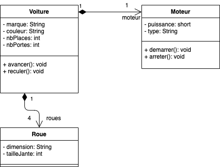
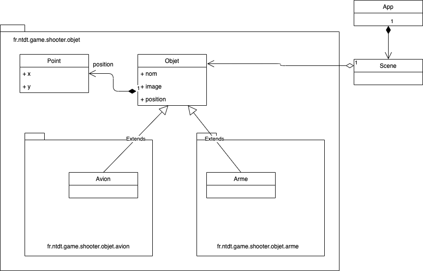

# Formation Java

## Comment récupérer ce projet ?

Commencez par créer un dossier nommé `formation`, puis positionnez-vous dans ce réperoire et lancez la commande ci-dessous pour récupérer le projet Git.

```
cd formation
git clone https://github.com/nntran/training-java java
```

## Travaux pratiques

### TP1 - Hello World!

Découverte des outils (java, javac, ...) fournis dans le Kit de déceloppement Java (JDK)

### TP2 - Modélisation des classes

Traduire en langage Java le diagramme des classes ci-dessous.



**Objectifs:**

* Apprendre à concevoir des classes
* Apprendre à créer des constructeurs, données membres, typer les données, ...
* Apprendre à générer des getter/setter des données membres de d'une classe
* Apprendre à surcharger (override) la méthode `toString()` de la super classe `Object`


### TP3 - Jeu de tir d'avion

**Objectifs:**

* Apprendre à concevoir des classes (avion, arme, ...)
* Apprendre à faire de l'héritage
* Apprendre à surcharger des méthodes
* Apprendre à utiliser des abstraites

